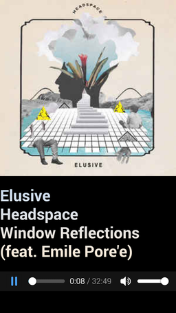

**Introducing a way to play your mpd music from just about anywhere.**

*Features:*

  * Stream music from mpd http output to any device which supports html5
  * Display album art
  * Display song info
  * Works locally, on a LAN, or over an ssh connection
  * Able to toggle full-screen display. Simply touch the album art to toggle full-screen status.

**Getting started:**

  * make sure http output is enabled in your mpd conf. The system default for most debian-based distros is for mpd to run as the system user, so if you haven't configured mpd, it's probably in /etc/mpd.conf. Add the following: 

        audio_output {
        	type		"httpd"
        	name		"mpd radio"
        	encoder		"lame"		# optional, vorbis or lame
        	port		"8000"
        	bind_to_address "0.0.0.0"               # optional, IPv4 or IPv6
        	bitrate		"128"			# do not define if quality is defined
        	format		"44100:16:1"
        	max_clients     "0"                     # optional 0=no limit
        }

  * note the "port 8000" in that snippet. This is the port to stream music from. You are welcome to use a different port - you'll just have to use a url variable, which I'll demonstrate at the bottom.

  * if you had to change your mpd.conf, you'll also need to restart mpd. If your config is /etc/mpd.conf, use:

        sudo systemctl restart mpd.service

  * get [my mpd_what script](https://github.com/charmparticle/mpd_what), and set it to run periodically - you can do this with conky, or you can run it periodicaly with a shell script, like this, using Ctrl+C to quit it later:

        #!/bin/bash
        while true; do
          ~/bin/mpd_what -q >/dev/null 2>&1 &
          sleep 5
        done

  * Now, add a symbolic link to your `last` to your coverart dir. If your coverart dir is ~/Pictures/coverart, then you'd do this:

        ln -s ~/.config/mpd_what/last ~/Pictures/coverart/last

  * Now, copy play.htm to your coverart dir:

        cp play.htm ~/Pictures/coverart

  * Now, if your coverart dir doesn't already serve http, here's how you can make it do that:

        cd ~/Pictures/coverart && python3 -m http.server 8888

  * The above command serves HTTP on TCP port 8888 on your computer. Now, get your ip address:

        ip addr | grep 'inet ' | grep -v 127.0.0.1 | awk '{print $2}' | sed 's#/.*##'

  * Now point your phone or tablet to this html file. If the ip address you got in the last step was 192.168.1.101, and you are using python to serve http on port 8888, you'd use this url:

        http://192.168.1.101:8888/play.htm

  * If your http streaming port is something other than 8000, for example, if it's 8001, you would change the 'sp' url variable, so your url would look like this instead:

        http://192.168.1.101:8888/play.htm?sp=8001
        
  * If your http streaming port is 8000, and your http port is the standard, which is port 80, and play.htm is in a folder named "albumart" in your www root, then your url would look like this:
  
        http://192.168.1.101/albumart/play.htm

  * To play over ssh, install an ssh app and forward your http port and your http streaming port to localhost. If you decide to forward your http port to 8888 and your http streaming to port 8001, your url would look like this:

        http://localhost:8888/play.htm?sp=8001
        
All that's left to do is play music on your mpd server. There are lots of apps to do that.

That's it! Enjoy.

#If all you want to do is play music, and you don't care about the coverart or anything, here is an even easier solution:

  * Enable http out in your mpd.conf, as above

  * Install apache or nginx or some other http server.

  * In the wwwroot, or whatever you prefer, add an index.htm file with the following:

    <html>
        <head>
            <title>MPD Radio</title>
        </head>
        <body>
            <audio controls="" preload="auto" src="http://localhost:8000">
            </audio>
        </body>
    </html>

  * Make sure to change port 8000 in the html to whatever you used for your http out.
    
  * Now you can browse to the ip of your web browser, at whatever port it runs on, and whatever dir you installed the index.htm file on, and get streaming music.
